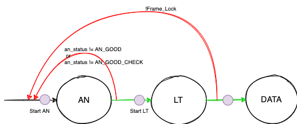
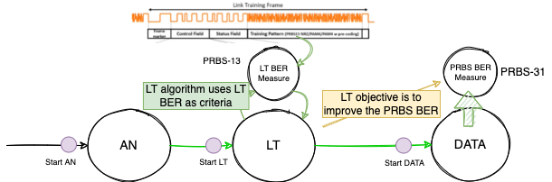
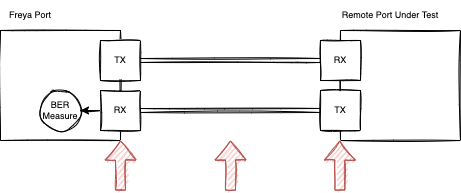

Introduction
===============

Auto-Negotiation in Link Training Test
----------------------------------------

In accordance with the IEEE standard, in the event of a failure during the ANLT procedure, the port should initiate the procedure anew, as illustrated in :numref:`an_in_lt` below.

Freya, functioning as a test port, possesses the capability to perform AN and LT as distinct and autonomous processes. Nevertheless, remote ports under test from different vendors may lack this capability. Consequently, when conducting LT tests, the testing port must activate or deactivate AN based on the settings configured on the remote port.

.. _an_in_lt:

    AN in LT test

PRBS BER Measurement
---------------------

As depicted in :numref:`prbs_ber`, the LT phase involves the measurement of LT BER using the **PRBS-13** pattern. The LT algorithm relies on these LT BER values as its criteria.

It's essential to clarify that LT's primary goal is to enhance the PRBS BER during the DATA phase. However, it's important to note that the pattern employed during the DATA phase may not necessarily be PRBS-13.

Therefore, any LT algorithm should strive to **IMPROVE** the PRBS BER rather than degrade it. Any LT algorithm that has a detrimental impact on the PRBS BER must be categorized as a "poor" algorithm.

.. _prbs_ber:

    LT BER and PRBS BER

Adaptive RX and Fixed RX
--------------------------

The BER measurement is taken from the perspective of the local receiver, as depicted in :numref:`adaptive_rx` below. Consequently, the BER value is influenced by the performance of the port's receiver, the quality of the cable, and the behavior of the remote transmitter. Given that the port's RX can dynamically adapt to the received signal, the measured BER may not accurately represent the true signal quality of the remote transmitter. This implies that the BER measured by another port could be worse if its RX is not as proficient as Freya's.

In order to obtain a more accurate assessment of the remote TX, it is advisable for Freya's port to disable automatic adaptation during BER testing.

.. _adaptive_rx:

    LT BER and PRBS BER